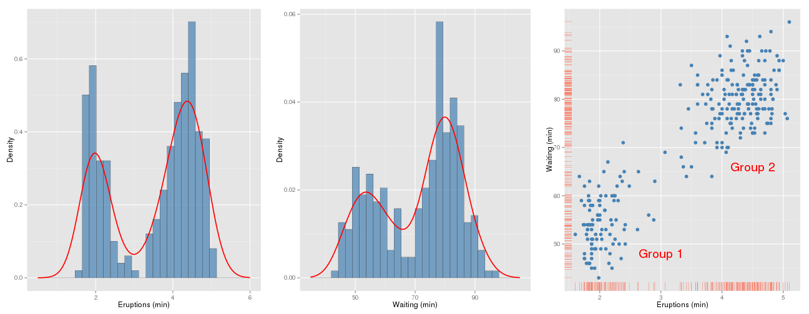

<font size=3px>The data frame available in **[R](http://www.r-project.org/ "Title")**, contains data about Old Faithful geyser in Yellowstone National Park, Wyoming, USA with 272 observations in two variables:
 - **eruptions:** duration of each eruption (in mins)
 - **waiting:** waiting time between eruptions (in mins).

Loading packages to help us with data analysis and data visualization.

```r
> library(ggplot2)   #graphics
> library(gridExtra) #graphics
> library(mixtools)  #em algorithm
```


Displaying the first 3 rows of the data frame `faithful` and visualizing the variable `waiting`.

```r
> data(faithful) #load data
> head(faithful, 3) #display 3 rows
```

```
  eruptions waiting
1     3.600      79
2     1.800      54
3     3.333      74
```

Note by the histograms of variables `waiting` and ``eruptions`` that they can be modeled as mixture of Gaussian distributions, because their histograms resembles strongly the data simulation of a Gaussian mixture, as you can see in the **<font color='#2fa4e7'>Simulation</font>** panel. Both histograms split the data between short and long waiting/eruption times. The scatter plot clearly shows two clusters, one of short times and other of long times.


```r
> histWait <- ggplot(faithful, aes(x=waiting, y=..density..)) + labs(x = "Waiting (min)", y = "Density")+  geom_histogram(fill="steelblue", colour="grey30", size=.2, alpha=0.7) + geom_line(stat="density", colour = 'red', size=.8) +  xlim(35, 105)
> histErup <- ggplot(faithful, aes(x=eruptions, y=..density..)) + labs(x = "Eruptions (min)", y = "Density")+  geom_histogram(fill="steelblue", colour="grey30", size=.2, alpha=0.7)  +  xlim(.5, 6) + geom_line(stat="density", colour = 'red', size=.8)
> histEsti <- ggplot(faithful, aes(x=eruptions, y=waiting)) + geom_point(size=3.5, shape=20, colour = 'steelblue') + geom_rug(position="jitter", size=.2, colour = 'tomato') + labs(x = "Eruptions (min)", y = "Waiting (min)") + 
+   annotate("text", x=3, y=48, label="Group 1", colour="red", size=7) + 
+   annotate("text", x=4.5, y=66, label="Group 2", colour="red", size=7)
> grid.arrange(histErup, histWait, histEsti, ncol=3)
```



</font>
